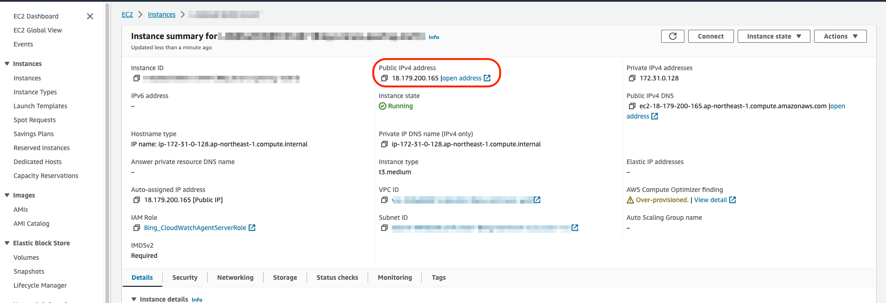

## 說明：本文章主要介紹如何使用DBeaver透過ssh連線至跳板機EC2並連至private subnet的RDS中，以下將分別說明EC2、RDS以及DBeaver的設定

## 最後編輯日期:2023.10.30

## EC2設置
1. EC2 並無需要特別設置，僅需在建立EC2時建立ssh key。
2. 需要在Security group的inbound rule 中開啟22 port，建議將ip設置為限制特定範圍的ip，即不要使用0.0.0.0/0

## RDS設置
1. 在建立Connectivity時可以直接使用"Connect to an EC2 compute resource"連結上方建立的EC2。
2. 在Connectivity中的Virtual private cloud(VPC)項中應選擇與EC2相同的VPC。若是使用不同VPC則需要使用peering。

## DBeaver設置
1. 點選左上方的插頭圖示開始設定 
 

2. 選擇databases

3. 先選擇Main設定與database的連線，在Server Hot設定輸入RDS的Endpoint，並確認port是否與設定相同，最後輸入Username以及Password \
 

4. 設定SSH連線
(1) 選至SSH \
(2) 勾選"Use SSH Tunnel" \
(3) 在Settings中將Host/IP加入，EC2的IP可以參考下圖，User Name預設為ec2-user，Private Key則是選擇在EC2設定時建立的ssh key。 \

(4) 完成後點選右下Finish即可完成相關設置，直接點選右側列表就能夠透過Bastion連線RDS

